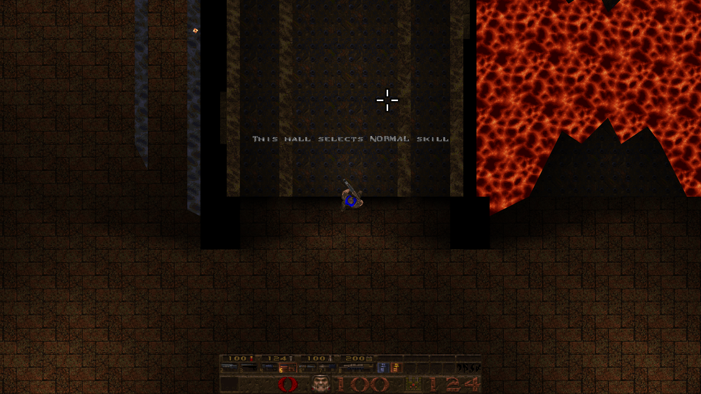

# TopDownQuake

TDQ is a CSQC-only Quake mod allowing you to play the game in a fully top-down view, in the style of classic top-down twin-stick shooters like the NES game Commando.

The code has been entirely rewritten from the ground up, not relying on any code or assets from the old versions of the mod.

The latest release can be downloaded in the releases section, or on [Slipseer](https://www.slipseer.com/index.php?resources/topdownquake.24/).

- Current Release Version: `2.2 (June 13, 2025)` (now includes the 2022 mapping jam content!)

## Console Commands

| Command			| Parameters 	| Default				| Description				|
|-------------------|---------------|-----------------------|---------------------------|
| `tdq_toggle`		|				|						| Toggle TDQ mode.			|
| `tdq_enable`		|				|						| Enable TDQ mode.			|
| `tdq_disable`		|				|						| Disable TDQ mode.			|
| `tdq_scale`		| `float`		| `1.0`					| Set TDQ render scale. 	|
| `tdq_offset`		| `vector`		| `0 0 64`				| Set TDQ render offset.	|
| `tdq_clear`		| `vector`		| `0 0 0`				| Set TDQ clear color.		|
| `tdq_reset`		|				|						| Reset all TDQ values.		|
| `tdq_verbose`		| `int`			| `0`					| Print debug info or not.	|
| `tdq_halo_scale`	| `float`		| `0.5`					| Set TDQ halo scale.		|
| `tdq_halo_pic`	| `string` 		| `gfx/tdq/halo.png`	| Set TDQ halo image.		|
| `tdq_halo_alpha`	| `float`		| `0.5`					| Set TDQ halo opacity.		|
| `tdq_halo_color`	| `vector`		| `0.25 0.25 1.0` 		| Set TDQ halo color.		|
| `tdq_halo_active`	| `int`			| `0`					| Set TDQ halo state.		|
| `+tdq`			| 				|						| Quick-enable TDQ mode.	|
| `-tdq`			| 				|						| Quick-disable TDQ mode.	|

## Planned Features

- Bring back features from the older versions, like fog-of-war and other settings.
- ~~Add March-April 2022 jam content.~~
- Add robust controller bindings.
- Add DOOM-Automap style mode.
- Add optional tracers for hitscan weapons.
- Add optional halos for enemies.

## Launching

Before launching, make sure to copy the `id1` folder from your copy of Quake into the `game` folder. After that, you can launch the executable appropriate for your platform.

- Windows: `fteqw64.exe`
- Linux: `fteqw64`

## Building

To build the QuakeC code for TopDownQuake, use the `fteqcc64` application (which can be downloaded [here](https://www.fteqcc.org/)) and point it to `/source/progs.src`.

## License

MIT License

Copyright (c) 2022-2025 erysdren (it/its)

Permission is hereby granted, free of charge, to any person obtaining a copy
of this software and associated documentation files (the "Software"), to deal
in the Software without restriction, including without limitation the rights
to use, copy, modify, merge, publish, distribute, sublicense, and/or sell
copies of the Software, and to permit persons to whom the Software is
furnished to do so, subject to the following conditions:

The above copyright notice and this permission notice shall be included in all
copies or substantial portions of the Software.

THE SOFTWARE IS PROVIDED "AS IS", WITHOUT WARRANTY OF ANY KIND, EXPRESS OR
IMPLIED, INCLUDING BUT NOT LIMITED TO THE WARRANTIES OF MERCHANTABILITY,
FITNESS FOR A PARTICULAR PURPOSE AND NONINFRINGEMENT. IN NO EVENT SHALL THE
AUTHORS OR COPYRIGHT HOLDERS BE LIABLE FOR ANY CLAIM, DAMAGES OR OTHER
LIABILITY, WHETHER IN AN ACTION OF CONTRACT, TORT OR OTHERWISE, ARISING FROM,
OUT OF OR IN CONNECTION WITH THE SOFTWARE OR THE USE OR OTHER DEALINGS IN THE
SOFTWARE.
